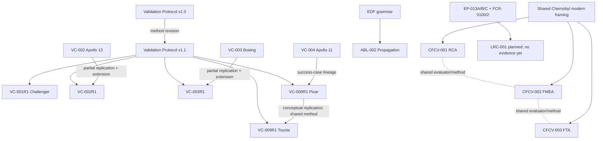

# Non-Human Experimental Lineage and Dependency Map

## Independence conclusion

The repository contains 12 completed experimental or quasi-experimental records, but not 12 independent evidence units. A defensible clustering yields four evidence families:

1. Internal validation-case family.
2. Initial exploratory-case family.
3. Comparative-method family.
4. Single ablation.

Even those families share the EDF repository's authorship, concepts, and evaluation environment. The effective count of externally independent replications is zero.

## Lineage

## Replication matrix

| Original experiment | Replication | Independence | Result | Replication strength |
|---|---|---|---|---|
| VC-002 | VC-002R1 | Low; same case and research system | Dynamic-state concern persists | Partial, dependent |
| VC-003 | VC-003R1 | Low; same case and research system | Network interpretation persists | Partial, dependent |
| VC-004 | VC-008R1 | Low; different case, shared method/evaluator | Success describable with EDF | Conceptual, weak |
| VC-008R1 | VC-009R1 | Low; different domain, shared protocol/evaluator | Learning-system narrative recurs | Conceptual, weak |
| CFCV-001 | CFCV-002/003 | None as replication; methods differ, data/evaluator shared | Complementarity narrative recurs | Shared-method extension |
| ABL-002 | None | N/A | No replication | None |

## Shared dependency inflation

The six R1 case records must not be counted as six independent confirmations that VP v1.1 improves reproducibility. They reuse the same protocol, lenses, unspecified evaluator, agreement logic, and repository assumptions. Case diversity improves breadth but not evaluator or method independence.

Similarly, CFCV-001/002/003 are one comparative program using one case framing and one evaluation style. They provide three method contrasts, not three independent validations of EDF.

## Supersession

- R1 cases extend rather than erase the early Apollo 13 and Boeing records.
- Validation Protocol v1.1 supersedes v1.0 methodologically, but the repository has no controlled head-to-head execution supporting causal improvement.
- EDF v1.0 is a draft and does not supersede authoritative v0.3.
- No completed experimental record declares formal supersession metadata.

